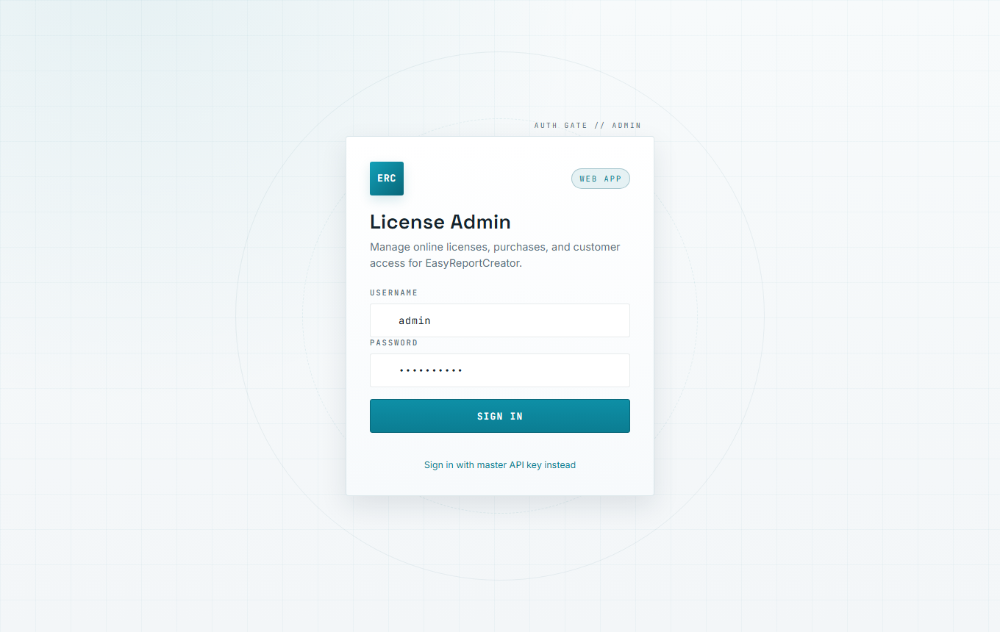
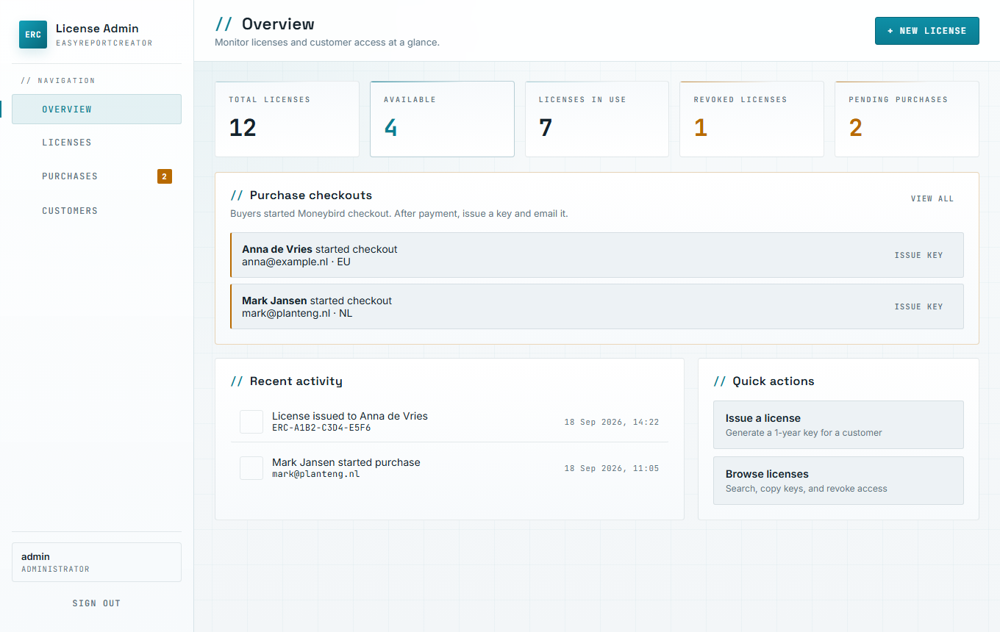
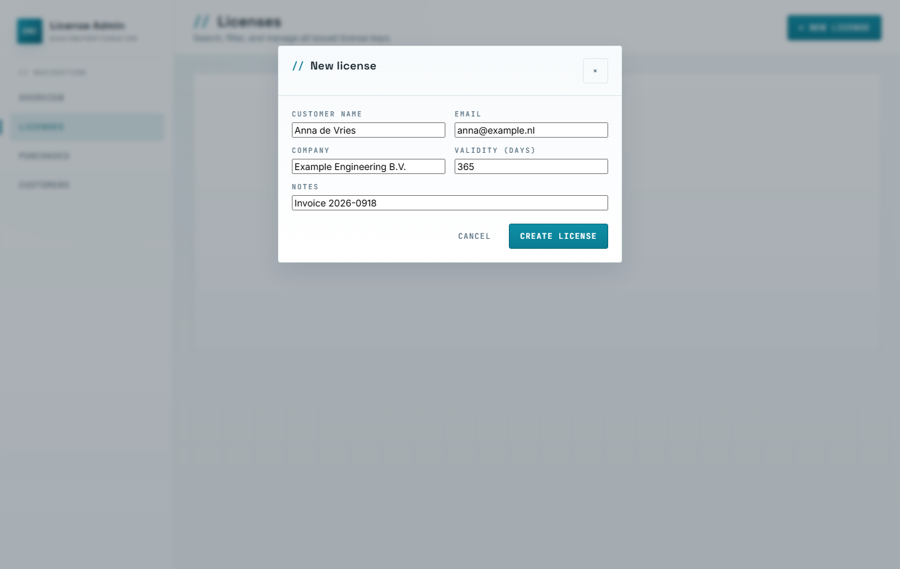
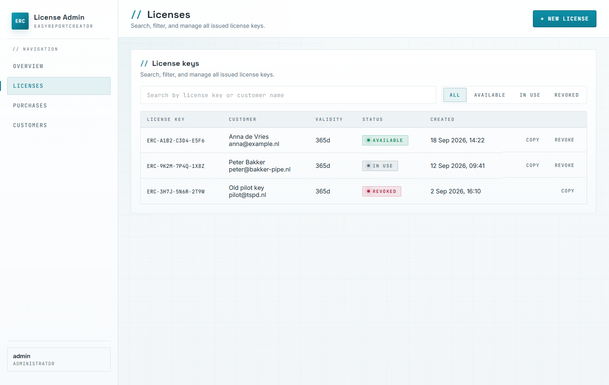
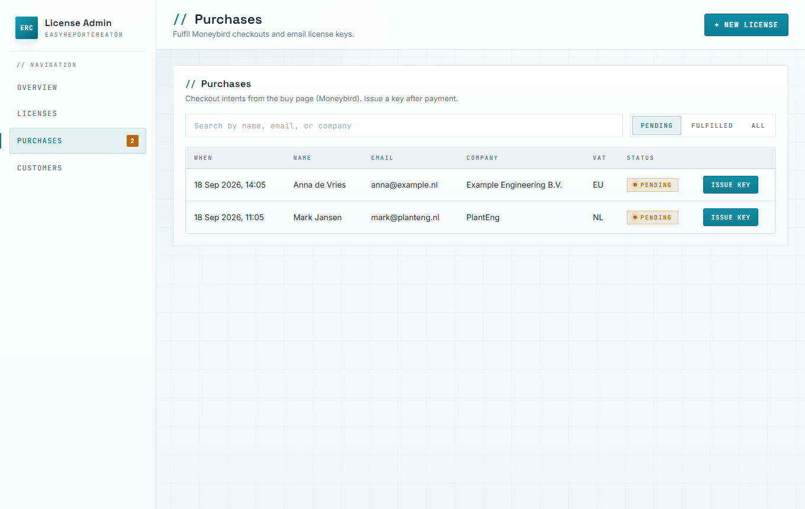
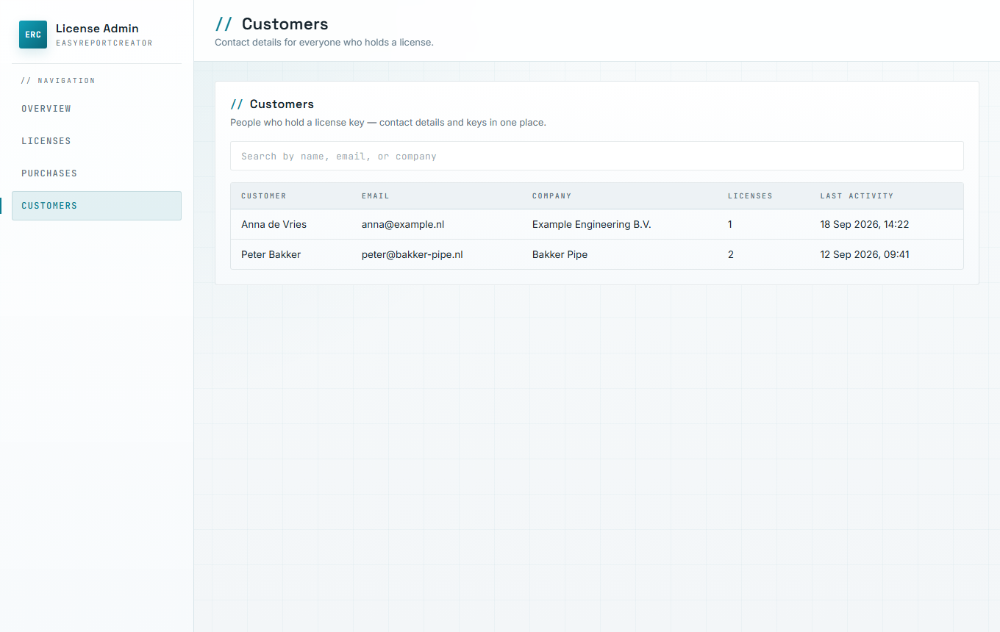

# License Admin Manual — EasyReportCreator

**PDF (illustrated):** [license-admin/License-Admin-Operator-Guide.pdf](license-admin/License-Admin-Operator-Guide.pdf)  
**HTML print source:** [license-admin/License-Admin-Operator-Guide.html](license-admin/License-Admin-Operator-Guide.html)  
**Doc ID:** ERC-OPS-LIC-001 · Rev B · 26 Sep 2026  

The admin UI uses a **light theme** (teal accents on white / pale grey). Screenshots below match the current interface.

Use the **PDF** when sharing with Jan or support — it includes screenshots for each step of licence issuance.

---

## 1. What this panel is for

**URL:** https://easyreportcreator.com/admin/

| Task | Where |
|---|---|
| See totals (available / in use / revoked / pending purchases) | **Overview** |
| Create a licence key by hand | **Licenses** → New license |
| Fulfil a Moneybird checkout (issue + email key) | **Purchases** or **Overview** |
| Copy or revoke a key | **Licenses** |
| Browse people who hold keys | **Customers** |

Customers activate keys in the report app: https://easyreportcreator.com/report/licence.php

---

## 2. Sign in

1. Open https://easyreportcreator.com/admin/
2. Username + password, or master API key (alternate link on the form)
3. **Sign in**

Credentials: server `website/inc/config.local.php` only — do not paste into email.

---

## 3. Overview

Stat cards, pending Moneybird checkouts (**Issue key**), recent activity. Sidebar badge on **Purchases** = pending count.

---

## 4. Issue a licence manually

1. **+ New license**
2. Name, email, company, validity (default 365), notes
3. **Create license**
4. On **Licenses**, **Copy** the key and send it to the customer

The 365-day clock starts at **customer activation**, not at create time.

---

## 5. Fulfil a Moneybird purchase

1. Confirm payment in Moneybird  
2. **Purchases** → Pending → **Issue key**  
3. System creates key, marks fulfilled, emails buyer (if mail works), copies key  

Do not fulfil twice.

---

## 6. Customers

Read-only contacts derived from issued keys.

---

## 7. Tell the customer

1. Sign in at https://easyreportcreator.com/report/login.php  
2. Open **Licence**  
3. Paste key → **Activate 1-year licence**  

Plant 3D not required — only `ProcessPower.dcf`.

---

## 8. Daily checklist

1. Sign in to `/admin/`  
2. Check pending purchases  
3. After payment → Issue key  
4. Confirm email / resend key if needed  
5. Refunds / abuse → **Revoke**  

---

*Illustrated PDF: `docs/manuals/license-admin/License-Admin-Operator-Guide.pdf`*
